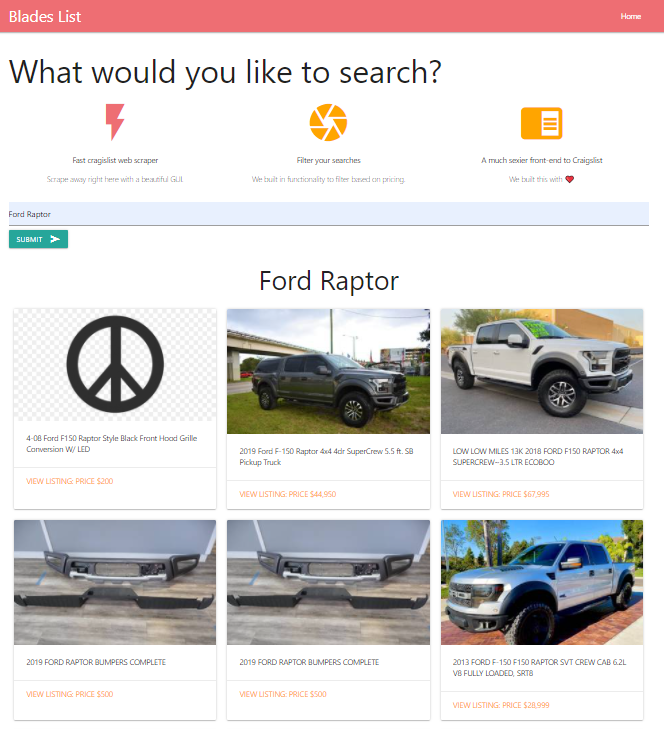

# Blademasters_List

## Info
 
This was my first Django project that scrapes Cragislist LA and displays the ads in a nice thumbnail display so its easily to view what you are searching for.

## Available Scripts

In the project directory, and in your python virtual environment:

### `pip install -r requirement.txt`

Runs the app in the development mode. 

### `python manage.py runserver`

Open [http://localhost:8000](http://localhost:8000) to view it in the browser.

## Example Image

